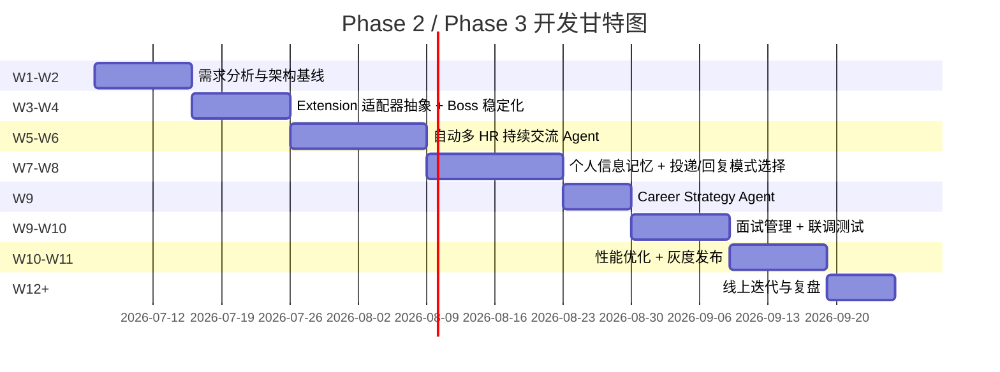

# AI Career Copilot - MVP 后续开发规划（Phase 2 / Phase 3）

> 版本：v2.1.0  
> 日期：2026-07-04  
> 总周期：10 - 12 周  
> 前置条件：[MVP Extension 补全计划](file:///g:/my/my_file/AI%20Career%20Copilot/docs/plans/mvp_extension_completion_plan.md) 已验收通过  
> 开发原则：**单模块串行开发、LLM 必异步、安全与反检测基线**

---

## 1. 规划总览

### 1.1 背景与目标

MVP 阶段完成后端核心 API 与 Extension 基础闭环（岗位提取 → 分析 → 匹配 → 话术 → 投递）。Phase 2 / Phase 3 聚焦构建产品的核心差异化能力：

1. **自动与多个人事交流 Agent**：监听 Boss 直聘等平台聊天列表中的 HR 新消息，结合岗位信息 + 用户简历 + 历史记忆生成回复建议；需要个人信息时暂停询问用户；用户确认后自动发送；同时管理多个 HR 对话并按优先级有序处理。
2. **账号安全与反检测**：操作频率限制、随机化间隔、真人行为模拟、不脱离用户浏览器环境、内容去重、手动/自动模式切换、操作审计日志、暂停/急停按钮、严格遵守平台规则。
3. **投递/回复模式选择**：用户可在发起沟通前选择“打招呼 + 自动投递简历”或“只打招呼/回复信息，不主动发简历”。后端 API 与 Extension UI 均需支持，并记录用户默认偏好。
4. **用户信息记录与长期记忆**：当 Agent 询问个人信息（期望薪资、到岗时间、是否接受加班、base 地等）时记录回答；输入框提供“是否记录本次回复，供以后直接使用”开关；记录信息存入 Agent 长期记忆（pgvector）；下次遇到同类问题优先复用；用户可在设置中查看/修改/删除。
5. **补齐求职闭环**：Career Strategy Agent、面试管理、性能优化、灰度部署。

### 1.2 交付标准

- 每个模块完成后必须通过单元测试 + 集成测试，核心链路测试覆盖率 ≥ 80%。
- 每个模块配套 API 文档、Extension 交互说明、数据库变更说明。
- 不引入破坏性变更；如必须变更，提供迁移脚本与兼容性说明。
- **所有新增 LLM/Agent 任务遵循 MQ 异步流水线**。
- 所有 IO 操作使用 async/await。
- 所有自动化操作必须内置安全与反检测策略，并通过安全评审。
- 多 HR Agent 必须基于 **LangGraph 状态机 + checkpoint 持久化** 实现。
- 个人信息长期记忆必须基于 **pgvector 向量检索**。

### 1.3 角色与职责

| 角色 | 主要职责 | 关键交付物 |
|------|---------|-----------|
| 产品经理/项目负责人 | 需求澄清、优先级排序、里程碑评审、跨团队协调、合规边界确认 | PRD 更新、里程碑验收单、会议纪要 |
| 后端负责人 | 后端架构、API 设计、Agent Runtime、LangGraph 状态机、数据库设计、MQ Consumer、性能优化 | API 文档、数据库迁移脚本、压测报告 |
| 前端/Extension 负责人 | Extension 多平台适配、UI/UX、前后端联调、浏览器兼容性、反检测策略落地 | Extension 包、交互流程说明、平台适配矩阵 |
| 测试负责人 | 测试策略、用例设计、自动化测试、集成测试、安全测试、Bug 跟踪 | 测试计划、测试报告、自动化用例 |
| DevOps/运维负责人 | 环境搭建、CI/CD、灰度发布、监控告警、日志收集 | 部署文档、监控大盘、回滚方案 |
| LLM/算法负责人（可兼任） | Prompt 工程、Agent 行为设计、Embedding 相似度、回复质量评估、合规过滤 | Prompt 版本库、评估集、合规检查清单 |
| 安全/合规负责人（可兼任） | 反检测策略、操作审计、法律边界、平台规则解读 | 安全评审报告、合规清单 |

### 1.4 与 MVP 的衔接

- MVP 补全计划验收通过后，方可进入 Phase 2。
- MVP 中沉淀的 `PlatformAdapter` 接口、Service Worker 消息协议、SidePanel Vue 状态基座将直接复用。
- Phase 2 的数据库迁移脚本在 W1-W2 统一完成，避免后续模块重复返工。

---

## 2. 核心开发原则

### 2.1 单模块串行开发

Phase 2 严格遵循“一个模块跑通再开下一个”：

- 每个模块有独立的开发、测试、验收窗口。
- 模块内部前后端可并行，但**不同模块之间不并行**。
- 每个模块验收通过的标准：功能可用、测试通过、文档更新、无 P0/P1 Bug。
- 若某模块延期，整体计划顺延，不压缩下游模块时间。

### 2.2 LLM 必异步

| 任务类型 | 处理方式 | 原因 |
|----------|----------|------|
| 岗位分析 | MQ + 轮询 | 已落地，Phase 2 继续沿用 |
| 沟通话术生成 | MQ + 轮询/推送 | 已落地，Phase 2 继续沿用 |
| 多 HR 回复建议 | MQ + 推送 | LLM 调用，耗时且需重试 |
| Career Strategy 报告 | MQ + 轮询/推送 | 聚合大量数据后调用 LLM |
| 个人信息识别与记忆复用 | MQ/同步 Embedding | Embedding 检索可同步；LLM 判断走 MQ |

### 2.3 安全与反检测基线

所有自动化功能（投递、回复 HR、信息采集）必须同时满足：

- 操作频率受限、间隔随机化、行为模拟真人。
- 不脱离用户本地浏览器环境，不保存平台 Cookie/Token。
- 内容去重，避免重复发送相同话术。
- 支持手动/自动模式切换，提供暂停/急停按钮。
- 所有 Agent 操作留痕审计，用户可查看、导出、删除。
- 明确法律与平台规则边界，不做违规批量投递、虚假简历、恶意骚扰。

---

## 3. 需求分析与规划阶段（W1-W2）

> W1-W2 不仅是“写文档”，还要完成公共架构、数据基线、接口契约与安全策略，避免后续模块重复返工。

### 3.1 用户故事

| 史诗 | 用户故事 | 验收标准 |
|------|----------|----------|
| 多 HR 自动交流 | 作为一名求职者，我希望 Agent 自动监听多个 HR 的消息并生成回复建议，以便我快速回应多位招聘方 | 可同时监听 ≥5 个 HR 对话；为每个对话生成 1-3 条回复建议；按优先级排队 |
| 个人信息记忆 | 作为一名求职者，我希望 Agent 记住我的常见回答（薪资、到岗时间等），避免每次被重复询问 | 首次回答后可选择记录；后续同类问题 90% 以上自动复用 |
| 投递/回复模式 | 作为一名求职者，我希望选择“自动投递简历”或“仅回复”，以控制我的求职节奏 | 模式切换即时生效；后端强制校验模式权限 |
| 账号安全 | 作为一名用户，我希望 Agent 的操作不会导致我的招聘平台账号被封禁 | 频率受限、间隔随机、操作可审计、可随时暂停 |
| 求职策略 | 作为一名求职者，我希望系统基于我的投递与沟通数据生成策略建议 | 投递 ≥10 条后可生成报告；报告包含回复率、方向建议、技能差距、下一步行动 |
| 面试管理 | 作为一名求职者，我希望记录面试时间并收到提醒 | 面试 CRUD 可用；创建面试后 Application 状态联动；24h/1h 提醒触达 |

### 3.2 技术栈确认

| 层级 | 技术选型 | 说明 |
|------|----------|------|
| Agent 编排 | LangGraph + checkpoint | 多 HR 对话状态机、持久化、人机交互节点 |
| Checkpoint 存储 | PostgreSQL（通过 LangGraph PostgresSaver） | 利用现有 PG，避免引入新数据库 |
| 长期记忆向量检索 | pgvector + SentenceTransformer/OpenAI Embedding | 存储个人信息记忆，语义相似度检索 |
| 消息队列 | RabbitMQ | 任务异步分发、失败重试、死信队列 |
| 实时通知 | WebSocket / Server-Sent Events | 多 HR Agent 向 Extension 推送回复建议、询问请求 |
| Extension | Vue 3 + Pinia + TypeScript + Chrome MV3 | 复用 MVP 工程底座 |
| 后端 | FastAPI + SQLAlchemy 2.0 + asyncpg | 复用 MVP 架构 |

### 3.3 风险登记册（初稿）

| 风险 | 可能性 | 影响 | 应对策略 |
|------|--------|------|----------|
| 招聘网站 DOM 结构频繁变更 | 高 | 高 | Adapter selector 外置配置化，建立监控与快速修复机制，Boss 优先稳定 |
| 多 HR Agent 被平台识别为机器人 | 中 | 高 | 严格限制频率、随机延迟、真人行为模拟、内容去重、异常熔断 |
| LLM 输出不稳定导致回复质量差 | 中 | 高 | Prompt 版本化、输出 Schema 校验、失败重试 3 次、降级到模板 |
| 个人信息记忆复用错误 | 中 | 中 | 相似问题匹配引入置信度阈值，低置信度仍询问用户，用户可纠正 |
| 模式切换与权限控制漏洞 | 中 | 高 | 后端强制校验模式权限，所有自动化操作检查用户授权状态 |
| LangGraph checkpoint 性能瓶颈 | 中 | 中 | 为 checkpoint 表建索引；定期清理 CLOSED 会话的历史 checkpoint |
| pgvector 相似度阈值调优困难 | 中 | 中 | 先用规则 + Embedding 双路召回，A/B 测试确定阈值 |

### 3.4 架构与数据基线任务

| 编号 | 任务 | 责任人 | 验收标准 | 依赖 |
|------|------|--------|----------|------|
| PRE-01 | Phase 2 需求澄清工作坊 | 产品经理 | 逐项确认模块范围、边界、验收标准，输出需求确认表 | - |
| PRE-02 | 多平台 Adapter 架构设计 | 前端/Extension 负责人 | 定义 Adapter 抽象接口、生命周期、错误处理、selector 配置化方案 | - |
| PRE-03 | Agent Runtime、LangGraph 状态机与 MQ 主题设计 | 后端负责人 | 定义 communication.agent、strategy.agent、memory.agent 队列与消息格式 | - |
| PRE-04 | 安全与反检测策略设计 | 安全/合规负责人 + 前端负责人 | 输出频率限制、随机化、行为模拟、审计、法律边界方案 | - |
| PRE-05 | 公共数据库迁移脚本 | 后端负责人 | Conversation、Memory、Interview、AuditLog、ModePreference 等表迁移成功 | - |
| PRE-06 | 接口契约与 DTO 定义 | 后端负责人 | OpenAPI/Markdown 文档覆盖 Phase 2 所有新增接口 | PRE-05 |
| PRE-07 | LangGraph checkpoint 表设计 | 后端负责人 | checkpoint 表/字段与 LangGraph PostgresSaver 兼容 | PRE-05 |
| PRE-08 | pgvector 扩展与 Memory 向量表设计 | 后端负责人 | PG 启用 vector 扩展，Memory 表含 embedding 字段与索引 | PRE-05 |

### 3.5 W1-W2 交付物

- `docs/architecture/phase2_architecture.md`
- `docs/security/anti_detection_strategy.md`
- `docs/agent/langgraph_state_machine.md`
- 数据库 Alembic 迁移脚本（公共表）
- `docs/api/phase2_api_contract.md`
- 需求确认表与风险登记册

---

## 4. 开发阶段划分（W1-W12）



### 4.1 W1-W2：需求分析、架构基线 + 公共数据迁移

**目标**：完成 Phase 2 所有新增模块的架构方案、数据模型、接口契约、安全策略，输出可执行计划与模块间依赖图。

**责任人**：后端负责人主导，产品经理、前端/Extension 负责人、LLM/算法负责人、安全/合规负责人参与。

| 编号 | 任务 | 责任人 | 验收标准 |
|------|------|--------|----------|
| W1-01 | 完成 Phase 2 需求澄清工作坊 | 产品经理 | 用户故事、 acceptance criteria、优先级确认 |
| W1-02 | 确定 LangGraph 状态机设计（多 HR Agent） | 后端负责人 | 状态图、节点、边、checkpoint 落点确定 |
| W1-03 | 确定 pgvector 记忆检索方案 | 后端 + 算法负责人 | Embedding 模型、相似度算法、阈值策略确定 |
| W1-04 | 确定反检测策略清单 | 安全/合规负责人 | 频率、随机化、行为模拟、审计、熔断方案通过评审 |
| W2-01 | 完成公共数据库迁移脚本 | 后端负责人 | Alembic 迁移在 dev/test 环境成功执行 |
| W2-02 | 完成接口契约文档 | 后端负责人 | 覆盖 Conversation、Memory、Mode、Strategy、Interview、AuditLog |
| W2-03 | 完成 Adapter 抽象接口评审 | 前端/Extension 负责人 | 接口定义通过代码评审 |

**里程碑 M0 - 架构与数据基线**：公共表迁移成功，接口契约评审通过，安全策略双签。

### 4.2 W3-W4：多平台 Extension 适配器抽象 + Boss 直聘稳定化

**目标**：抽象出统一的 Extension Adapter 框架，稳定 Boss 直聘现有链路，建立可扩展的平台接入框架。

**后端任务**

| 编号 | 任务 | 责任人 | 验收标准 | 依赖 |
|------|------|--------|----------|------|
| BE-01 | 扩展 Job 创建接口支持 `platform` 字段与原始数据快照 | 后端负责人 | `POST /jobs` 接收 `platform` 与 `raw_data`，DTO 校验通过 | PRE-05 |
| BE-02 | 扩展 Application 表：增加 `platform`、`source_url`、`raw_data`、`status` | 后端负责人 | Alembic 迁移成功，不影响 MVP 数据 | PRE-05 |
| BE-03 | 平台字段查询与统计接口 | 后端负责人 | `GET /jobs?platform=boss` 可用，统计接口按平台聚合 | BE-01 |
| BE-04 | 投递/沟通状态回调接口 | 后端负责人 | Extension 可上报投递结果、沟通发送结果、错误码 | BE-02 |

**前端/Extension 任务**

| 编号 | 任务 | 责任人 | 验收标准 | 依赖 |
|------|------|--------|----------|------|
| FE-01 | 设计 Adapter 抽象基类与生命周期 | 前端/Extension 负责人 | 统一接口：`detect()` / `parseJob()` / `parseConversation()` / `injectPanel()` / `observeChanges()` / `simulateHumanAction()` | PRE-02 |
| FE-02 | Boss 直聘 Adapter 稳定化 | 前端/Extension 负责人 | 岗位解析成功率 ≥ 98%，投递/沟通触发成功率 ≥ 95%，错误可上报 | - |
| FE-03 | 实现反检测基础能力：随机延迟、鼠标轨迹模拟、操作间隔抖动 | 前端/Extension 负责人 | 所有自动化操作前加入随机 800ms-3000ms 延迟，操作间隔符合人类分布 | PRE-04 |
| FE-04 | 实现操作审计日志上报 | 前端/Extension 负责人 | 每次自动化操作记录类型、目标、时间、结果到后端 AuditLog | FE-02 |
| FE-05 | 猎聘 Adapter POC | 前端/Extension 负责人 | 岗位详情页解析成功率 ≥ 90%，验证 Adapter 抽象层可扩展 | FE-01 |

**里程碑 M1 - Extension 底座**：Boss 链路成功率达标，Adapter 抽象接口评审通过。

### 4.3 W5-W6：自动多 HR 持续交流 Agent（核心重点）

**目标**：实现 Phase 2 最核心的高优先级功能。Agent 监听多个 HR 的回复；为每个活跃对话生成回复建议；对多个 HR 对话进行有序排队管理；等待用户授权后，由 Extension 在用户本地浏览器环境中自动发送回复；支持暂停、急停、手动/自动模式切换。

#### 4.3.1 LangGraph 状态机设计

```text
                    ┌─────────────┐
                    │    START    │
                    └──────┬──────┘
                           │ 监听聊天列表
                           ▼
                    ┌─────────────┐
                    │   LISTEN    │ 检测未读 HR 消息
                    └──────┬──────┘
                           │ 提取对话上下文
                           ▼
                 ┌───────────────────┐
                 │  CLASSIFY_INTENT  │ 判断 HR 消息意图
                 └─────────┬─────────┘
                           │
           ┌───────────────┼───────────────┐
           ▼               ▼               ▼
    ┌──────────┐   ┌────────────┐   ┌──────────┐
    │ NEED_INFO│   │   REPLY    │   │  IGNORE  │
    │(需个人信息)│   │ (普通回复)  │   │ (无需回复) │
    └────┬─────┘   └─────┬──────┘   └────┬─────┘
         │               │               │
         ▼               ▼               ▼
    ┌──────────┐   ┌────────────┐   ┌──────────┐
    │ RETRIEVE │   │  GENERATE  │   │  UPDATE  │
    │ MEMORY   │   │  REPLIES   │   │  STATUS  │
    └────┬─────┘   └─────┬──────┘   └────┬─────┘
         │               │               │
         ▼               ▼               ▼
    ┌──────────┐   ┌────────────┐        │
    │  ASK_USER│   │ HUMAN_REVIEW│        │
    │(弹出询问) │   │ (展示建议)  │        │
    └────┬─────┘   └─────┬──────┘        │
         │               │               │
         │    ┌──────────┘               │
         │    ▼                          │
         │ ┌────────┐                    │
         │ │ AUTHORIZE│                  │
         └─┤  (用户确认)                  │
           └───┬────┘                    │
               │                         │
               ▼                         │
          ┌─────────┐                    │
          │  SEND   │  Extension 自动填入并发送
          └────┬────┘                    │
               │                         │
               ▼                         │
          ┌─────────┐◄───────────────────┘
          │ UPDATE  │
          │CONVERSATION
          └────┬────┘
               │
               ▼
          ┌─────────┐
          │ CHECKPOINT 持久化
          └─────────┘
```

**状态说明**：

- **LISTEN**：Extension 监听招聘平台聊天列表，上报新消息。
- **CLASSIFY_INTENT**：Agent 判断 HR 消息是否需要个人信息、是否普通回复、是否可忽略。
- **RETRIEVE_MEMORY**：对需要个人信息的问题，先检索 pgvector 长期记忆。
- **ASK_USER**：记忆缺失或置信度低时，Extension 弹出询问框；用户回答时可勾选“记录本次回复”。
- **GENERATE_REPLIES**：基于岗位、简历、记忆、历史对话生成 1-3 条回复建议。
- **HUMAN_REVIEW**：Extension 展示建议，用户选择发送哪一条或编辑后发送。
- **AUTHORIZE**：用户确认后进入待发送状态；自动模式下可配置“信任该 HR”免授权。
- **SEND**：Extension 在用户本地浏览器中模拟真人操作填入并发送消息。
- **CHECKPOINT**：每个节点结束后写入 PostgreSQL，支持崩溃恢复与重入。

#### 4.3.2 后端任务

| 编号 | 任务 | 责任人 | 验收标准 | 依赖 |
|------|------|--------|----------|------|
| BE-05 | 设计 Conversation 领域模型 | 后端负责人 | 字段含 `platform`、`hr_name`、`hr_title`、`company`、`job_title`、`last_message`、`status`、`priority`、`queued_at` | PRE-05 |
| BE-06 | 实现 Conversation Repository 与 Service | 后端负责人 | CRUD、按用户/状态/优先级查询、更新最后消息 | BE-05 |
| BE-07 | 实现多 HR 对话调度器 | 后端负责人 | 同一用户同时处理的对话数 ≤ 3，按优先级和时间排队，避免高频并发 | BE-06 |
| BE-08 | 实现 Communication Reply Agent（LangGraph） | 后端负责人 + 算法负责人 | 订阅 `communication.reply.agent` 队列，读取对话上下文 + 用户简历 + 个人信息记忆，生成 1-3 条回复建议；使用 LangGraph checkpoint 持久化 | BE-06 |
| BE-09 | 实现回复建议审核与授权接口 | 后端负责人 | `POST /conversations/{id}/reply-suggestions` 生成建议，`POST /conversations/{id}/send-authorized-reply` 用户确认后标记为待发送 | BE-08 |
| BE-10 | 实现发送结果回调与状态流转 | 后端负责人 | Extension 上报发送成功后更新 Conversation 状态；失败进入重试队列 | BE-09 |
| BE-11 | 实现多 HR Agent 的暂停/急停/模式切换接口 | 后端负责人 | `POST /users/{id}/agent-control` 支持 pause/resume/stop/mode 变更 | BE-07 |
| BE-12 | WebSocket / SSE 推送通道 | 后端负责人 | Agent 生成回复建议、需要询问用户时，可实时推送到 Extension | BE-08 |

#### 4.3.3 前端/Extension 任务

| 编号 | 任务 | 责任人 | 验收标准 | 依赖 |
|------|------|--------|----------|------|
| FE-06 | Extension 对话监听模块 | 前端/Extension 负责人 | 监听 Boss/猎聘等平台的消息列表变化，提取未读 HR 消息并上报后端 | FE-02/FE-05 |
| FE-07 | 多 HR 对话面板 UI | 前端/Extension 负责人 | 展示对话列表、未读数、优先级、回复建议、发送状态 | FE-06 |
| FE-08 | 回复建议展示与授权发送流程 | 前端/Extension 负责人 | 用户可选择「发送建议 1/2/3」或「编辑后发送」，确认后 Extension 在用户浏览器中自动填入并发送 | BE-09 |
| FE-09 | 自动/手动模式切换与暂停急停按钮 | 前端/Extension 负责人 | Extension 面板提供模式切换、全局暂停、单对话急停，操作后实时同步后端 | BE-11 |
| FE-10 | 发送前安全随机化与去重 | 前端/Extension 负责人 | 自动发送前随机延迟、检查 24h 内是否已发送过相似内容，避免重复 | FE-03 |
| FE-11 | 操作审计日志本地展示 | 前端/Extension 负责人 | 用户可查看最近 50 条 Agent 操作记录 | FE-04 |

**里程碑 M2 - 多 HR Agent**：端到端闭环测试通过，无 P0/P1 Bug。

### 4.4 W7-W8：用户个人信息记忆系统 + 投递/回复模式选择

**目标**：建立用户个人信息记忆系统，支持“首次记录、后续复用”；同时支持用户选择运行模式，后端与 Extension UI 均需支持并记录默认偏好。

#### 4.4.1 个人信息记忆系统

**记忆类型**：

- `personal_info`：期望薪资、到岗时间、base 地、是否接受加班、学历、工作年限等。
- `preference`：意向城市、意向行业、公司规模偏好等。
- `experience`：项目经验、技术栈深度等（可选，Phase 2 先聚焦 personal_info）。

**记忆生命周期**：

```text
Agent 需要个人信息
        │
        ▼
检索 pgvector 长期记忆
        │
   ┌────┴────┐
   ▼         ▼
命中且     缺失或
置信度高   置信度低
   │         │
   ▼         ▼
 直接使用  Extension 弹窗询问用户
            │
            ▼
     用户输入答案
            │
     ┌──────┴──────┐
     ▼             ▼
  勾选“记录”    不记录
     │             │
     ▼             ▼
 写入 pgvector   仅本次使用
```

#### 4.4.2 投递/回复模式选择

| 模式 | 行为 | 适用场景 |
|------|------|----------|
| 模式 A：`auto_apply_and_reply` | 打招呼 + 自动投递简历 + 自动回复 HR | 希望快速大量投递 |
| 模式 B：`reply_only` | 只打招呼/回复信息，不主动发简历（等 HR 要再发） | 希望先沟通，保留简历主动权 |

**后端权限控制**：

- `POST /api/users/{id}/agent-mode` 保存用户模式偏好。
- 所有自动投递/发送简历操作前，Service 层强制检查当前模式；`reply_only` 模式下禁止自动发送简历。
- 模式切换记录审计日志。

#### 4.4.3 后端任务

| 编号 | 任务 | 责任人 | 验收标准 | 依赖 |
|------|------|--------|----------|------|
| BE-13 | 设计 Memory 领域模型 | 后端负责人 | 字段含 `memory_type`、`key`、`value`、`source`、`confidence`、`expires_at`、`embedding` | PRE-05 |
| BE-14 | 实现 Memory Service 与 Repository | 后端负责人 | 支持写入、更新、按 key/语义检索、软删除 | BE-13 |
| BE-15 | 实现个人信息识别与询问 Agent | 后端负责人 + 算法负责人 | 当 HR 消息涉及薪资、到岗时间、期望城市等字段时，Agent 判断缺少记忆则返回询问任务 | BE-08 |
| BE-16 | 实现相似问题匹配与记忆复用 | 后端负责人 + 算法负责人 | 使用规则 + Embedding 相似度，对相似问题复用已有记忆；置信度低时仍询问用户 | BE-14 |
| BE-17 | 实现用户记忆管理 API | 后端负责人 | `GET /memories`、`POST /memories`、`PATCH /memories/{id}`、`DELETE /memories/{id}` | BE-14 |
| BE-18 | 实现用户运行模式配置 | 后端负责人 | `GET/POST /users/{id}/agent-mode` 支持 `auto_apply_and_reply` / `reply_only` | - |
| BE-19 | 模式切换与投递权限控制 | 后端负责人 | 模式为 `reply_only` 时，禁止自动投递简历；模式切换记录审计日志 | BE-18 |

#### 4.4.4 前端/Extension 任务

| 编号 | 任务 | 责任人 | 验收标准 | 依赖 |
|------|------|--------|----------|------|
| FE-12 | Extension 模式选择 UI | 前端/Extension 负责人 | 用户在面板中选择运行模式，选择后立即生效并同步后端 | BE-18 |
| FE-13 | 个人信息询问弹窗 | 前端/Extension 负责人 | Agent 需要补充信息时弹出询问，用户可输入答案并勾选「记录本次回复」 | BE-15 |
| FE-14 | 记忆管理页面 | 前端/Extension 负责人 | 用户可查看、编辑、删除已记录个人信息 | BE-17 |
| FE-15 | 模式相关按钮状态联动 | 前端/Extension 负责人 | `reply_only` 模式下隐藏自动投递入口，`auto_apply_and_reply` 模式下显示 | BE-19 |

**里程碑 M3 - 记忆与模式**：记忆复用率达标，模式切换可用。

### 4.5 W9：Career Strategy Agent

**目标**：基于用户的投递记录、HR 沟通记录、面试记录、个人信息记忆，生成求职策略报告。

**后端任务**

| 编号 | 任务 | 责任人 | 验收标准 | 依赖 |
|------|------|--------|----------|------|
| BE-20 | 设计 Strategy Report 领域模型 | 后端负责人 | 字段含 `report_type`、`summary`、`metrics`、`recommendations`、`raw_data_snapshot` | PRE-05 |
| BE-21 | 实现投递/沟通/面试数据统计聚合 | 后端负责人 | 按岗位类型、公司规模、技能方向、城市分组统计投递数、回复数、面试数、Offer 数 | BE-02/BE-06 |
| BE-22 | 实现 Career Strategy Agent | 后端负责人 + 算法负责人 | 订阅 `strategy.agent` 队列，读取聚合数据 + 个人信息记忆，生成策略报告 | BE-21 |
| BE-23 | 策略报告生成与查询 API | 后端负责人 | `POST /strategy/reports` 返回 task_id，`GET /strategy/reports/{id}` 返回报告内容 | BE-22 |
| BE-24 | 策略报告周期性调度 | 后端负责人 | 每周日凌晨触发一次，投递记录 ≥ 10 的用户才会生成 | BE-23 |

**前端/Extension 任务**

| 编号 | 任务 | 责任人 | 验收标准 | 依赖 |
|------|------|--------|----------|------|
| FE-16 | 策略报告展示面板 | 前端/Extension 负责人 | 展示回复率、方向建议、技能差距、下一步行动，支持手动刷新 | BE-23 |
| FE-17 | 报告生成进度提示 | 前端/Extension 负责人 | 用户触发后显示任务进度，完成后展示报告 | BE-23 |

**里程碑 M4 - 策略 Agent**：策略报告生成、展示可用。

### 4.6 W9-W10：面试管理 + 联调测试

**目标**：提供面试创建、编辑、查询、删除能力；与 Application 状态联动；提供面试前 24 小时与 1 小时提醒；完成 Phase 2 核心模块的集成测试。

#### 4.6.1 面试管理后端任务

| 编号 | 任务 | 责任人 | 验收标准 | 依赖 |
|------|------|--------|----------|------|
| BE-25 | 设计 Interview 领域模型 | 后端负责人 | 字段含 `application_id`、`interview_time`、`location`、`round`、`format`、`status`、`notes`、`feedback` | PRE-05 |
| BE-26 | 实现 Interview Service 与 Repository | 后端负责人 | CRUD + 状态流转（SCHEDULED/COMPLETED/PASSED/FAILED/OFFERED/CANCELLED） | BE-25 |
| BE-27 | 实现 Interview RESTful API | 后端负责人 | `POST /interviews`、`GET /interviews`、`GET /interviews/{id}`、`PATCH /interviews/{id}`、`DELETE /interviews/{id}` | BE-26 |
| BE-28 | 实现面试提醒调度任务 | 后端负责人 | 基于 RabbitMQ 延迟队列或 APScheduler，在 24h/1h 前触发通知 | BE-26 |
| BE-29 | 面试与 Application 状态联动 | 后端负责人 | 创建/取消面试时同步更新 Application 状态，记录状态变更日志 | BE-26 |

#### 4.6.2 面试管理前端任务

| 编号 | 任务 | 责任人 | 验收标准 | 依赖 |
|------|------|--------|----------|------|
| FE-18 | 面试管理面板 | 前端/Extension 负责人 | 面试列表、创建/编辑表单、状态筛选、面经输入 | BE-27 |
| FE-19 | 面试提醒通知 | 前端/Extension 负责人 | 面试前通过 Extension 弹窗或 WebSocket 推送提醒 | BE-28 |
| FE-20 | 从 Application 一键创建面试 | 前端/Extension 负责人 | 在投递记录页面可直接创建面试，自动带入岗位信息 | BE-29 |

#### 4.6.3 联调与测试任务

| 编号 | 任务 | 责任人 | 验收标准 |
|------|------|--------|----------|
| INT-01 | 多 HR Agent 端到端联调 | 后端 + 前端 | 监听 → 生成建议 → 授权 → 发送闭环通过 |
| INT-02 | 记忆复用联调 | 后端 + 前端 | 首次询问 → 记录 → 二次复用闭环通过 |
| INT-03 | 模式选择联调 | 后端 + 前端 | 模式切换 → 投递权限控制闭环通过 |
| INT-04 | 策略报告联调 | 后端 + 前端 | 触发 → 生成 → 展示闭环通过 |
| INT-05 | 面试管理联调 | 后端 + 前端 | 创建 → 提醒 → 状态联动闭环通过 |
| INT-06 | 安全与反检测专项测试 | 测试 + 安全负责人 | 频率限制、随机延迟、审计日志、暂停急停验证通过 |
| INT-07 | 接口自动化测试 | 测试负责人 | 新增 API 接口 100% 覆盖正常/异常分支 |
| INT-08 | 浏览器兼容性测试 | 前端/Extension 负责人 | Chrome/Edge 最新两个大版本可用 |

**里程碑 M5 - 面试与联调**：面试状态联动可用，核心流程回归通过。

### 4.7 W10-W11：性能优化 + 部署灰度

**目标**：对 Phase 2 新增模块进行数据库索引、缓存、MQ 优化；完成压测；完成 Staging 部署与灰度发布。

#### 4.7.1 后端任务

| 编号 | 任务 | 责任人 | 验收标准 | 依赖 |
|------|------|--------|----------|------|
| BE-30 | 数据库索引优化 | 后端负责人 | Conversation、Memory、Interview、Application 核心查询 Explain 无全表扫描 | 全部模块 |
| BE-31 | Redis 缓存策略 | 后端负责人 | Strategy Report、Memory 热点数据命中缓存，缓存失效与更新策略正确 | 全部模块 |
| BE-32 | MQ Consumer 并发与死信队列调优 | 后端负责人 | communication/strategy/memory 队列并发数、prefetch、死信策略调优 | 全部模块 |
| BE-33 | pgvector 索引与查询性能优化 | 后端负责人 | Memory 语义检索 Top-K 延迟 < 100ms（95 分位） | BE-16 |
| BE-34 | 压测脚本准备与执行 | 后端负责人 + DevOps | locust/artillery 100 并发，95% 接口延迟达标，无消息丢失 | BE-30~BE-32 |
| BE-35 | 压测报告与优化迭代 | 后端负责人 | 报告含瓶颈分析、优化方案、验证结果 | BE-34 |

#### 4.7.2 前端/Extension 任务

| 编号 | 任务 | 责任人 | 验收标准 | 依赖 |
|------|------|--------|----------|------|
| FE-21 | Extension 性能优化 | 前端/Extension 负责人 | 减少 DOM 监听开销、优化 WebSocket 重连、面板首屏加载 < 500ms | 全部模块 |
| FE-22 | Extension 打包与版本管理 | 前端/Extension 负责人 | 输出可发布的 Extension 包，版本号与后端对齐 | 全部模块 |

#### 4.7.3 测试/DevOps 任务

| 编号 | 任务 | 责任人 | 验收标准 | 依赖 |
|------|------|--------|----------|------|
| OPS-01 | 回归测试 | 测试负责人 | Phase 2 所有模块核心流程 100% 通过 | 全部模块 |
| OPS-02 | 安全扫描 | 测试负责人 | 新增接口鉴权、PII 过滤、SQL 注入、XSS 无高危漏洞 | 全部模块 |
| OPS-03 | Staging 部署 | DevOps | Staging 环境全量功能可用，压测复跑通过 | BE-35 |
| OPS-04 | 灰度发布 | DevOps + 后端负责人 | 5% → 20% → 50% → 100%，每个阶段观察 2h | OPS-03 |
| OPS-05 | 监控告警配置 | DevOps | Prometheus/Grafana/Sentry 覆盖业务、性能、错误、资源指标 | OPS-04 |
| OPS-06 | 回滚方案演练 | DevOps | 数据库回滚脚本、服务蓝绿切换、灰度开关关闭流程演练通过 | OPS-04 |

**里程碑 M6 - 灰度上线**：灰度发布完成，线上核心指标正常。

### 4.8 W12 及以后：迭代优化

**目标**：基于线上数据与用户反馈持续优化。

| 编号 | 任务 | 责任人 | 验收标准 |
|------|------|--------|----------|
| ITR-01 | 用户反馈收集与分类 | 产品经理 | 建立反馈渠道与分类标签 |
| ITR-02 | 回复质量评估与 Prompt 迭代 | 算法负责人 | 每周评估 100 条回复，质量分提升或保持稳定 |
| ITR-03 | 反检测策略迭代 | 安全/合规负责人 | 根据平台检测特征调整频率与行为模拟策略 |
| ITR-04 | 新增平台 Adapter 评估 | 前端/Extension 负责人 | 评估智联、51job、拉勾等平台接入优先级 |
| ITR-05 | 长期记忆效果复盘 | 后端 + 算法负责人 | 记忆复用率、误用率指标入盘 |

---

## 5. 联调与测试阶段（W9-W10）

### 5.1 联调范围

联调覆盖 Phase 2 全部核心链路：

1. **多 HR Agent 链路**：Extension 监听 → 后端 Conversation 创建 → LangGraph Agent 生成建议 → Extension 展示 → 用户授权 → Extension 自动发送 → 后端状态更新。
2. **个人信息记忆链路**：Agent 需要信息 → 检索 pgvector → 缺失则弹窗询问 → 用户回答 → 选择记录 → 写入向量库 → 下次复用。
3. **模式选择链路**：Extension 切换模式 → 后端持久化 → 自动投递/发送简历时后端权限校验。
4. **Career Strategy 链路**：用户触发 → MQ 任务 → 数据聚合 → LLM 生成报告 → Extension 展示。
5. **面试管理链路**：Extension 创建面试 → Application 状态联动 → 24h/1h 提醒触达。

### 5.2 测试策略

| 测试类型 | 范围 | 工具 | 通过标准 |
|----------|------|------|----------|
| 单元测试 | Service、Repository、Agent 节点、Adapter 工具函数 | pytest / Vitest | 核心模块覆盖率 ≥ 80% |
| 集成测试 | API 接口、MQ Consumer、LangGraph 状态流转 | pytest + httpx + 测试容器 | 核心链路 100% 通过 |
| E2E 测试 | Extension 在真实浏览器中的完整流程 | Playwright + Chrome Extension 模式 | 3 条核心链路通过 |
| 安全测试 | 反检测策略、鉴权、PII、注入、XSS | 手工 + semgrep | 无高危漏洞 |
| 性能测试 | 100 并发核心接口、pgvector 检索延迟 | locust / artillery | P99 < 2s，错误率 < 1% |

---

## 6. 部署与发布阶段（W10-W11）

### 6.1 环境配置

| 环境 | 用途 | 配置要点 |
|------|------|----------|
| Dev | 日常开发 | 本地 Docker Compose，启用 pgvector、RabbitMQ、Redis |
| Test | 自动化测试 | 每次 CI 自动部署，数据隔离 |
| Staging | 预发布验证 | 与生产同规格，压测复跑 |
| Production | 灰度/全量 | 分阶段放量，监控告警就绪 |

### 6.2 灰度发布策略

```text
阶段 1：5% 用户（2 小时观察）
   │  核心指标：错误率、P99 延迟、MQ 死信、Extension 崩溃率
   │  通过 → 阶段 2
   ▼
阶段 2：20% 用户（2 小时观察）
   │  增加：多 HR Agent 发送成功率、记忆复用率
   │  通过 → 阶段 3
   ▼
阶段 3：50% 用户（24 小时观察）
   │  增加：用户反馈、平台检测告警
   │  通过 → 全量
   ▼
阶段 4：100% 用户
```

### 6.3 回滚方案

- **配置开关**：`AGENT_AUTO_REPLY_ENABLED`、`AGENT_AUTO_APPLY_ENABLED` 等特性开关可在 1 分钟内关闭。
- **数据库回滚**：保留 Alembic `downgrade` 脚本；发布前在 Staging 演练 downgrade。
- **Extension 回滚**：Chrome Web Store 保留上一个版本包，必要时引导用户回退。
- **MQ 消费暂停**：RabbitMQ 管理后台可一键暂停 communication agent consumer。

---

## 7. 账号安全与反检测专章

### 7.1 设计原则

- **用户授权优先**：任何自动化操作必须基于用户明确授权，用户可随时撤销。
- **本地运行优先**：Extension 在用户本地浏览器中执行操作，不脱离用户环境。
- **最小数据留存**：不保存招聘平台 Cookie、Token、密码等敏感凭证。
- **行为拟人**：操作频率、间隔、路径模拟真人，避免被平台识别为机器人。
- **可审计**：所有 Agent 操作留痕，用户可查看、导出、删除。
- **合规边界清晰**：明确法律与平台规则边界，不做违规批量投递、虚假简历、恶意骚扰。

### 7.2 反检测策略

| 策略 | 具体措施 | 责任人 | 落地模块 |
|------|---------|--------|----------|
| 操作频率限制 | 单用户单平台每分钟最多 N 次操作（投递/沟通），N 根据平台特性配置化 | 后端 + 前端 | W3-W4 Adapter |
| 随机化间隔 | 每次自动化操作前随机等待 800ms-3000ms，投递与沟通之间增加额外随机缓冲 | 前端 | W3-W4 Adapter |
| 真人行为模拟 | 模拟鼠标移动、滚动页面、输入停顿；自动发送前模拟点击输入框、粘贴文本 | 前端 | W5-W6 多 HR Agent |
| 内容去重 | 同一 HR 24h 内不发送语义相似内容；全局话术去重 | 后端 + 前端 | W5-W6 多 HR Agent |
| 不脱离浏览器环境 | 所有操作通过 Extension 在用户本地浏览器完成，不调用外部浏览器集群 | 前端 | W3-W4 Adapter |
| 不保存 Cookie | Extension 不持久化招聘平台 Cookie、Token、Session | 前端 | W3-W4 Adapter |
| 手动/自动模式 | 用户可选择全自动或仅建议模式；全自动下仍可选择单条授权 | 后端 + 前端 | W5-W6/W7-W8 |
| 暂停/急停 | 全局暂停按钮、单对话急停、后端任务取消接口 | 后端 + 前端 | W5-W6 多 HR Agent |
| 操作审计 | 记录操作类型、目标、时间、结果、模式、用户授权状态 | 后端 + 前端 | W3-W4 Adapter |
| 异常熔断 | 当平台返回验证码/登录态异常/频率限制时，自动暂停并通知用户 | 后端 + 前端 | W5-W6 多 HR Agent |

### 7.3 频率限制配置示例

```python
# 后端配置（示例）
PLATFORM_RATE_LIMITS = {
    "boss": {
        "send_message_per_minute": 5,
        "apply_per_hour": 20,
        "view_job_per_minute": 30,
    },
    "liepin": {
        "send_message_per_minute": 4,
        "apply_per_hour": 15,
        "view_job_per_minute": 25,
    },
}
```

### 7.4 法律与平台规则边界

| 边界 | 说明 |
|------|------|
| 用户授权范围 | Agent 只在用户已登录的浏览器标签页内、针对用户主动浏览/已投递的岗位执行操作 |
| 禁止行为 | 禁止绕过平台验证码、禁止伪造身份、禁止批量注册账号、禁止爬取非公开数据、禁止发送垃圾信息 |
| 数据使用 | 仅使用用户主动授权上传的简历与个人信息，不购买/爬取第三方简历库 |
| 平台规则 | 遵循各招聘平台公开的服务条款，如遇条款变更及时调整功能或下架相关平台 Adapter |
| 法律合规 | 遵守《个人信息保护法》《数据安全法》《网络安全法》等法律法规，用户数据最小化、可删除 |

### 7.5 审计与监控

| 审计项 | 记录内容 | 保留时间 |
|--------|---------|----------|
| Agent 操作日志 | 操作类型、目标平台、目标对象、执行时间、执行结果、模式、用户 ID | 90 天 |
| 模式切换日志 | 切换前模式、切换后模式、切换时间、用户 ID | 90 天 |
| 授权记录 | 用户授权/撤销授权时间、授权范围 | 90 天 |
| 异常熔断日志 | 触发原因、平台、用户 ID、时间 | 90 天 |
| 记忆写入日志 | memory_key、来源（用户主动/Agent 询问）、时间 | 90 天 |

---

## 8. 交付物清单

| 阶段 | 交付物 | 格式 | 负责人 |
|------|--------|------|--------|
| 规划 | 需求确认表 | Markdown | 产品经理 |
| 规划 | 架构设计文档（含 LangGraph 状态机、pgvector 记忆设计） | Markdown + 图 | 后端负责人 |
| 规划 | 安全与反检测策略 | Markdown | 安全/合规负责人 |
| 规划 | 数据库 ER 图与迁移脚本 | SQL/Alembic | 后端负责人 |
| 规划 | 接口契约文档 | Markdown/OpenAPI | 后端负责人 |
| W3-W4 | Adapter 框架与 Boss 稳定化代码 | TypeScript/Vue | 前端/Extension 负责人 |
| W5-W6 | 多 HR 持续交流 Agent 后端与 Extension 模块 | Python + TypeScript | 后端 + 前端负责人 |
| W7-W8 | 个人信息记忆系统 + 投递/回复模式选择 | Python + TypeScript | 后端 + 前端负责人 |
| W9 | Career Strategy Agent + 报告面板 | Python + TypeScript | 后端 + 算法 + 前端负责人 |
| W9-W10 | 面试管理后端与 Extension 面板 | Python + TypeScript | 后端 + 前端负责人 |
| W10-W11 | 压测报告、部署文档、监控告警 | Markdown + YAML | 后端 + DevOps |
| 全程 | 测试计划 + 测试报告 | Markdown | 测试负责人 |
| 迭代 | 用户反馈报告 + 复盘文档 | Markdown | 产品经理 + 全角色 |

---

## 9. 里程碑节点

| 里程碑 | 时间 | 交付物 | 验收标准 |
|--------|------|--------|----------|
| M0 - 架构与数据基线 | W2 结束 | 架构文档、数据库迁移脚本、接口契约、安全策略 | 公共表迁移成功，接口契约评审通过 |
| M1 - Extension 底座 | W4 结束 | Adapter 框架、Boss 直聘稳定化、猎聘 POC、反检测基础 | Boss 链路成功率达标，Adapter 抽象接口评审通过 |
| M2 - 多 HR Agent | W6 结束 | 多 HR 持续交流 Agent、授权发送、暂停急停、审计日志 | 端到端闭环测试通过，无 P0/P1 Bug |
| M3 - 记忆与模式 | W8 结束 | 个人信息记忆系统、模式选择、权限控制 | 记忆复用率达标，模式切换可用 |
| M4 - 策略与面试 | W10 结束 | Career Strategy Agent、面试管理、提醒 | 策略报告生成、面试状态联动可用 |
| M5 - 性能与发布就绪 | W11 结束 | 性能优化、压测报告、Staging 验证 | 回归测试通过，无 P0/P1 Bug |
| M6 - 灰度上线 | W12 结束 | 灰度发布完成、监控告警、迭代计划 | 线上核心指标正常，用户反馈机制运行 |

---

## 10. 附录

### 10.1 与 MVP 开发原则的衔接

- 继续遵循「LLM 必异步」：所有新增 Agent 任务走 RabbitMQ。
- 继续遵循「分层架构」：`api → service → repository → database`。
- 继续遵循「测试优先」：每个模块完成后必须编写单元/集成测试。
- 继续遵循「小步提交」：一个功能一个 Commit。
- 新增遵循「单模块串行」：Phase 2 模块间不并行。
- 新增遵循「安全基线」：所有自动化功能必须通过反检测与安全评审。

### 10.2 关键决策待确认项

| 编号 | 问题 | 建议方案 | 决策人 |
|------|------|----------|--------|
| D-01 | 自动发送前是否必须每次授权？ | 默认每次授权，高级用户可开启「信任该 HR/该岗位」免授权 | 产品经理 |
| D-02 | 个人信息记忆相似度匹配用规则还是 Embedding？ | 先用规则 + 轻量 Embedding 双路召回，后续根据效果迭代 | 后端负责人 + 算法负责人 |
| D-03 | 面试提醒用 RabbitMQ 延迟队列还是 APScheduler？ | 优先 RabbitMQ 延迟队列，fallback APScheduler | 后端负责人 |
| D-04 | 压测目标值如何定义？ | 100 并发下 P99 < 2s，错误率 < 1%，MQ 无死信堆积 | 后端 + DevOps |
| D-05 | 是否保存招聘平台 Cookie？ | 明确不保存，所有操作依赖用户当前浏览器会话 | 安全/合规负责人 |
| D-06 | LangGraph checkpoint 存储方式？ | 使用 LangGraph PostgresSaver，复用现有 PostgreSQL | 后端负责人 |
| D-07 | pgvector Embedding 模型选型？ | 中文场景优先使用开源 `BAAI/bge-small-zh-v1.5` 或 OpenAI `text-embedding-3-small` | 算法负责人 |

### 10.3 外部依赖

- LLM API 配额与预算（OpenAI / 国内大模型）。
- 招聘平台页面结构稳定（不可控，需监控）。
- Chrome Web Store 审核周期（Extension 发布）。
- pgvector PostgreSQL 扩展在目标数据库版本可用。
- LangGraph 与 PostgresSaver 版本兼容性。
- 域名、SSL 证书、服务器资源。
- 法律/合规对自动化求职工具的边界解释。

---

*本文档由产品经理牵头维护，每周根据实际进度更新一次，重大变更需经后端、前端/Extension、测试、安全负责人共同评审。*
